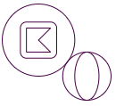
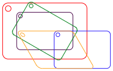
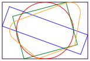
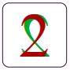

# TPVector

TPVector is a library for generating vector geometry and graphics for a laser
cutter. It consists of a number of tools helpful for generating
[SVG](https://pl.wikipedia.org/wiki/Scalable_Vector_Graphics) files that can be
imported into laser cutter software like
[LightBurn](https://lightburnsoftware.com/) or [VisiCut](https://visicut.org/),
both for cutting and engraving.

For quick start, see [Installation](wiki/installation.md).

For source code documentation, see [Documentation](docs/index.html), but note
that it is not ideal or complete right now. It is recommended to consult the
source code.

## Features

### [Basic figures](src/figures.ts)



<details><summary>Code</summary>

<!-- deno-fmt-ignore -->
```ts
gather(
  figures.circle({radius: 3}),
  figures.circle({center: [4, 3], radius: 2}),
  figures.rectangle({centered: true, side: 3, cornerRadius: 0.5}),
  figures.ellipse({center: [4, 3], radiusX: 1, radiusY: 2}),
);
```

</details>

### [Turtle graphics](src/turtle.ts)


<details><summary>Code</summary>

<!-- deno-fmt-ignore -->
```ts
Turtle.create()
  .forward(5).arcRight(120, 1).forward(1)
  .arcLeft(180, 1)
  .forward(1).arcLeft(120, 3).forward(5);
```

</details>

### [Geometric transforms](src/transformable.ts)



<details><summary>Code</summary>

<!-- deno-fmt-ignore -->
```ts
const object = gather(
  figures.rectangle({
    centered: true,
    width: 3,
    height: 2,
    cornerRadius: 0.2,
  }),
  figures.circle({
    center: [-1.3, -0.8],
    radius: 0.1,
  }),
);
const pieces = gather(
  object,
  object.scale(1.5).setAttributes({stroke: "red"}),
  object.translate(2, 1).setAttributes({stroke: "blue"}),
  object.rotateRight(30).setAttributes({stroke: "green"}),
  object.moveDown(1).skewTopToLeft(30).setAttributes({stroke: "orange"}),
);
```

</details>

### [Alignment and normalisation](src/normalise_transform.ts)



<details><summary>Code</summary>

<!-- deno-fmt-ignore -->
```ts
const frame = viewBoxFromPartial({width: 3, height: 2});
const pieces = gather(
  figures.rectangle(frame),
  [
    figures.circle()
      .setAttributes({stroke: "red"}),
    figures.rectangle({width: 40, height: 10}).rotateRight(20)
      .setAttributes({stroke: "blue"}),
    figures.rectangle({width: 5, height: 4}).rotateLeft(15)
      .setAttributes({stroke: "green"}),
    Turtle.create()
      .right(10).forward(3).arcLeft(120, 1).forward(5)
      .arcLeft(120, 1).forward(3).closePath()
      .setAttributes({stroke: "orange"}),
  ].map(pc => pc.normalise({target: frame, align: "center"})),
);
```

</details>

### [Layers](src/layers.ts)


<br> This is a single object with three layers: the outer circle is cut, the
green circle is scored (cut, but not all the way through), and the inner shape
is printed (engraved). See [Layers and runs](wiki/layers_and_runs.md) page for
more information.

<details><summary>Code</summary>

<!-- deno-fmt-ignore -->
```ts
Sheet.create({
  pieces: gather(
    // Cut this circle:
    figures.circle({radius: 3.4}),
    // Score this circle:
    figures.circle({radius: 3.2}).setLayer("score"),
    // Print this circle with the shape inside:
    gather(
      figures.circle({radius: 3}),
      Turtle.create()
        .curve(t => t.strafeLeft(4), {startSpeed: 4, targetSpeed: 3})
        .curve(t => t.strafeRight(4), {startSpeed: 3, targetSpeed: 4})
        .rotateRight().center()
        .setAttributes({fill: "white"}),
    ).setLayer("print"),
  ),
  // The list of runs and the layers they include.
  // In the comments, the default value of the `layers` parameter.
  runs: [
    {type: "cut", id: "score", /* layers: ["score"], */},
    {type: "print", /* layers: ["print"], */},
    {type: "cut", /* layers: [NO_LAYER, "cut"], */},
  ],
});
```

</details>

### [Text](src/text.ts)


<details><summary>Code</summary>

<!-- deno-fmt-ignore -->
```ts
createText("TPVector", {
  font: "monospace",
  size: 5,
  fontAttributes: {bold: true},
  attributes: {
    letterSpacing: "-0.05em",
  },
}).moveUp(0.1).mirrorY()
```

</details>

### [Dual-sided projects](wiki/dual_sided.md)


<br> The green layer will is printed on the back. See the
[Dual-sided projects](wiki/dual_sided.md) page for more information.

<details><summary>Code</summary>

<!-- deno-fmt-ignore -->
```ts
Sheet.create({
  pieces: [
    figures.rectangle({centered: true, cornerRadius: 0.1}),
    createText("2", {font: "Times New Roman"}).center()
      .flipX().setLayer("print_back"),
    createText("2", {font: "Times New Roman"}).center()
      .setLayer("print"),
  ],
  runs: [
    {type: "print", id: "print_back", side: "back"},
    {type: "print"},
    {type: "cut"},
  ],
});
```

</details>

TODO: Add information about more features:

- Assets
- Def tools
- Images
- Interlock
- Layouts
- Sheet
- Fonts
- External URLs

---

For a short summary of the coding style used in TPVector, see the
[Code style](wiki/code_style.md).

_Copyright © 2023 by TPReal_
