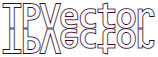
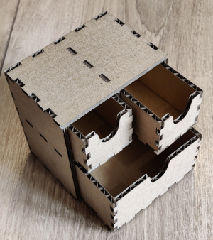

#  TPVector

TPVector is a library for generating vector geometry and graphics for a laser
cutter. It offers a number of tools helpful for generating
[SVG](https://pl.wikipedia.org/wiki/Scalable_Vector_Graphics) files that can be
imported into laser cutter software, like
[LightBurn](https://lightburnsoftware.com/) or [VisiCut](https://visicut.org/),
both for cutting and engraving.

## Quick start

See [Installation and usage](wiki/installation_and_usage.md).

The library gives a high level of both compile-time safety, thanks to
TypeScript, and runtime safety, thanks to immutability (see the
[Immutability](wiki/immutability.md) document).

<!-- TODO: Link to documentation using https://htmlpreview.github.io/. -->

For the source code documentation, see [Documentation](docs/index.html), but
note that it is neither ideal nor complete right now. It is recommended to
consult the source code of the library - the type system will provide a lot of
additional information.


## Features

### [Basic figures](src/figures.ts)


<details><summary>Code</summary>

<!-- deno-fmt-ignore -->
```ts
gather(
  figures.circle({radius: 3}),
  figures.rectangle({centered: true, side: 3, cornerRadius: 0.5}),
  figures.polygon([0, 0], [1, 1], [-1, 1], [-1, -1], [1, -1]),
  figures.circle({center: [4, 3], radius: 2}),
  figures.ellipse({center: [4, 3], radiusX: 1, radiusY: 2}),
)
```

</details>

### [Turtle graphics](wiki/turtle.md)


<details><summary>Code</summary>

<!-- deno-fmt-ignore -->
```ts
Turtle.create()
  .forward(5).arcRight(120, 1).forward(1)
  .arcLeft(180, 1)
  .forward(1).arcLeft(120, 3).forward(5)
```

</details>

See the [Turtle tutorial](wiki/turtle.md) document for advanced uses.

### [Geometric transforms](src/transformable.ts)


<details><summary>Code</summary>

<!-- deno-fmt-ignore -->
```ts
const myObject = gather(
  figures.rectangle({
    centered: true,
    width: 3,
    height: 2,
    cornerRadius: 0.2,
  }),
  figures.circle({
    center: [-1.3, -0.8],
    radius: 0.1,
  }),
);

const pieces = gather(
  myObject,
  myObject.scale(1.5).setAttributes({stroke: "red"}),
  myObject.translate(2, 1).setAttributes({stroke: "blue"}),
  myObject.rotateRight(30).setAttributes({stroke: "green"}),
  myObject.moveDown(1).skewTopToLeft(30).setAttributes({stroke: "orange"}),
);
```

</details>

### [Alignment and normalisation](src/normalise_transform.ts)


<details><summary>Code</summary>

<!-- deno-fmt-ignore -->
```ts
const frame = viewBoxFromPartial({width: 3, height: 2});
const pieces = gather(
  figures.rectangle(frame),
  [
    figures.circle()
      .setAttributes({stroke: "red"}),
    figures.rectangle({width: 40, height: 10}).rotateRight(20)
      .setAttributes({stroke: "blue"}),
    figures.rectangle({width: 5, height: 4}).rotateLeft(15)
      .setAttributes({stroke: "green"}),
    Turtle.create()
      .right(10).forward(3).arcLeft(120, 1).forward(5)
      .arcLeft(120, 1).forward(3).closePath()
      .setAttributes({stroke: "orange"}),
  ].map(pc => pc
    .normalise({target: frame, align: "center"})
  ),
);
```

</details>

### [Layers](src/layers.ts)


<br> This is a single object with three layers: the outer circle is cut, the
green circle is scored (cut, but not all the way through), and the inner shape
is printed (engraved). See [Layers and runs](wiki/layers_and_runs.md) document
for more information.

<details><summary>Code</summary>

<!-- deno-fmt-ignore -->
```ts
Sheet.create({
  pieces: gather(
    // Cut this circle:
    figures.circle({radius: 3.4}),
    // Score this circle:
    figures.circle({radius: 3.2}).setLayer("score"),
    // Print this circle with the shape inside:
    gather(
      figures.circle({radius: 3}),
      Turtle.create()
        .curve(t => t.strafeLeft(4), {startSpeed: 4, targetSpeed: 3})
        .curve(t => t.strafeRight(4), {startSpeed: 3, targetSpeed: 4})
        .rotateRight().center()
        .setAttributes({fill: "white"}),
    ).setLayer("print"),
  ),
  // The list of runs and the layers they include.
  // In the comments, the default value of the `layers` parameter.
  runs: [
    {type: "cut", id: "score", /* layers: ["score"], */},
    {type: "print", /* layers: ["print"], */},
    {type: "cut", /* layers: [NO_LAYER, "cut"], */},
  ],
})
```

</details>

### [Text](src/text.ts)



<details><summary>Code</summary>

<!-- deno-fmt-ignore -->
```ts
createText("TPVector", {
  font: "monospace",
  size: 5,
  fontAttributes: {bold: true},
  attributes: {
    letterSpacing: "-0.05em",
  },
}).moveUp(0.1).mirrorY()
```

</details>

#### [Web fonts](src/fonts.ts)


<br> The font is fetched from [Google Fonts](https://fonts.google.com/) and
embedded in the generated SVG. See [Using external resources](wiki/external.md)
for more details.

_Note:_ If the text using a web font is misaligned, refreshing the page should
help.

<details><summary>Code</summary>

<!-- deno-fmt-ignore -->
```ts
createText("TPVector", {
  font: await Font.googleFonts("Parisienne"),
  // Bonus: text path is used.
  textPath: {
    path: Turtle.create().turnBack().circle(3),
    align: "center",
    textAttributes: {
      // Improves letters joining.
      dominantBaseline: "central",
    },
  },
}).setLayer("print")
```

</details>

### [Images](src/images.ts), [external images](wiki/external.md)


<br> The images are fetched from a URL and embedded in the generated SVG. See
the [Using external resources](wiki/external.md) page for more details.

<details><summary>Code</summary>

<!-- deno-fmt-ignore -->
```ts
const jsLogo = (await Image.fromURL(
  "https://upload.wikimedia.org/wikipedia/commons/thumb/6/6a/JavaScript-logo.png/240px-JavaScript-logo.png"
));
const tsLogo = (await Image.fromURL(
  "https://upload.wikimedia.org/wikipedia/commons/thumb/4/4c/Typescript_logo_2020.svg/240px-Typescript_logo_2020.svg.png"
));
const pieces = gather(
  jsLogo.center().rotateRight(20),
  tsLogo.center().rotateLeft(20).moveRight(180),
);
```

</details>

### [Assets](src/assets.ts)

Resources like fonts and images can be loaded from assets, i.e. local files
placed alongside the code files.

<details><summary>Example code</summary>

<!-- deno-fmt-ignore -->
```ts
const myImage = await Image.fromAsset(import(`./my_image.png`));
const myFont = await Font.fromAsset({
  name: "My Font",
  urlAsset: import(`./my_font.woff2`),
});
```

</details>

### [Clipping, masking, gradients](src/def_tools.ts)


<details><summary>Code</summary>

<!-- deno-fmt-ignore -->
```ts
figures.circle()
  // Linear gradient for the fill.
  .useDefTool(createLinearGradient({
    stops: [
      {offset: 0, opacity: 0.6},
      {offset: 0.3, opacity: 0.6},
      {offset: 0.8, opacity: 0},
    ],
    from: [0, 0],
    to: [1, 1],
  }), "fill")
  // Radial gradient for the stroke
  .useDefTool(createRadialGradient({
    stops: [{offset: 0.8, opacity: 1}, {offset: 1, opacity: 0}],
  }), "stroke")
  .setAttributes({strokeWidth: 0.3})
  // Clip with a rectangle.
  .useDefTool(createClipPath(
    figures.rectangle({centered: true, width: 3, height: 1}).rotateLeft(10)
  ))
  .setLayer("print")
```

</details>

### [Layout](src/layouts.ts)


<details><summary>Code</summary>

<!-- deno-fmt-ignore -->
```ts
// Define some shapes.
const a = figures.circle({radius: 5});
const b = figures.rectangle({side: 10, centered: true}).rotateRight(25);
const c = Turtle.create()
  .forward(4).arcRight(120, 3)
  .forward(4).arcRight(120, 3)
  .forward(4).arcRight(120, 3)
  .center().rotateLeft(10);

const pieces = layouts.row({
  pieces: [

    // Block 1: Repeat figure `c` in a 3 by 3 grid.
    layouts.repeat({
      piece: c,
      rows: 3,
      columns: 3,
    }),

    // Block 2: Three rows of figures, collected in a column.
    // (Default gaps are 1.)
    layouts.column(
      layouts.row(a, b, c),
      layouts.row(c, a, b),
      layouts.row(b, c, a),
    ),

    layouts.layout({
      // Iterate over the cells of a 3-dimensional cube.
      // Can have any number of dimensions.
      count: [3, 3, 3],
      // Calculate a piece for the cell of the cube, where
      // `(i, j, k)` is the index of the cell.
      pieceFunc: (i, j, k) =>
        // Select the shape based on `i`.
        [a, b, c][i].center()
          // Set opacity based on `j`.
          .setAttributes({opacity: 1 - 0.3 * j})
          // Scale based on `k`.
          .scale(1 - 0.3 * k)
          // Move it to the right position, based on `i` and `j`.
          .translate(i * 12, j * 12)
    }),

  ].map(pc => pc.center()),
  gap: 5,
});
```

</details>

### [Dual-sided projects](wiki/dual_sided.md)


<br> The green layer will is printed on the back of this square token. See the
[Dual-sided projects](wiki/dual_sided.md) document for more information.

<details><summary>Code</summary>

<!-- deno-fmt-ignore -->
```ts
Sheet.create({
  pieces: [
    figures.rectangle({centered: true, cornerRadius: 0.1}),
    createText("2", {font: "Times New Roman"}).center()
      .flipX().setLayer("print_back"),
    createText("2", {font: "Times New Roman"}).center()
      .setLayer("print"),
  ],
  runs: [
    {type: "print", id: "print_back", side: "back"},
    {type: "print"},
    {type: "cut"},
  ],
});
```

</details>

### [Tabs and slots](src/interlock.ts)


<br> The [kerf correction](https://en.wikipedia.org/wiki/Saw#Terminology) is
applied. The leftmost item uses also optional inner corners radius that reduce
material stress to prevent breaking (useful for materials like acrylic).

<details><summary>Code</summary>

<!-- deno-fmt-ignore -->
```ts
// Prepare tabs and slots functions with the specified options.
const {tabs, slots} = turtleInterlock({
  // Calibrated for the given laser and material.
  kerf: kerfUtil.millimeters(0.15, {millimetersPerUnit: 1}),
  thickness: 3,
  tabsDir: "left",
  // Slightly rounded corners, to make joining the pieces easier.
  outerCornersRadius: 0.8,
});

// Define the pattern of tabs.
const interlockPattern = TabsPattern.base(5).tab(5).base(10).tab(10);

const pieces = layouts.row(

  Turtle.create()
    .andThen(tabs, {
      pattern: interlockPattern.matchingTabs(),
      // Override the direction.
      dir: "right",
    })
    .left().forward(10).left().forward(interlockPattern.length())
    .closePath(),

  Turtle.create()
    .andThen(tabs, interlockPattern)
    .right().forward(20).right()
    .andThen(tabs, interlockPattern.reverse())
    .closePath(),

  Turtle.create()
    .branch(slots, {
      pattern: interlockPattern.matchingSlots(),
      // Override some of the options.
      options: {innerCornersRadius: 0.5},
    })
    .right().forward(6).left().forward(interlockPattern.length())
    .left().forward(12).left().forward(interlockPattern.length())
    .closePath(),

);
```

</details>

## Important reads

- [Installation and usage](wiki/installation_and_usage.md)
- [Immutability](wiki/immutability.md)
- [Turtle tutorial](wiki/turtle.md)
- [Layers and runs](wiki/layers_and_runs.md)
- [Dual-sided projects](wiki/dual_sided.md)
- [Using external resources](wiki/external.md)

## Demos

To view the demos start the Viewer (follow the steps from
[Installation and usage](wiki/installation_and_usage.md)). The code can be found
in [demos_viewer](src/viewer/demos_viewer.ts).

Photos of some of the demo projects:

- [Coins](src/demos/coins.ts) - a [dual-sided project](wiki/dual_sided.md).
  <br> 
  <br> (the reversing frame shown on the left)
- [Tabs and slots](src/demos/tabs_and_slots.ts) - holds without glue (due to the
  kerf), even when made with 3-ply paperboard
  <br> 
  <br> 
  <br> 

---

For a short summary of the coding style used in TPVector, see the
[Code style](wiki/code_style.md).

_Copyright © 2023 by TPReal_
