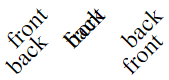

# Dual-sided projects

This document explains how to work with a project that requires engraving both
front and back side of the material, and cutting items out from a larger
material sheet. (For dual-sided engraving of pre-made items, it's best to simply
use jigs, but parts of this document can still be relevant.)

You need to be familiar with [Layers and runs](layers_and_runs.md) to understand
this document.

## Backside elements

The elements that should be printed (or scored) on the back of the material
should be assigned to a separate layer (or layers), for example `"print_back"`
or `"score_back"` (any names can be used).

The content of these layers needs to be flipped in the X axis - for example, a
text element should have `.flipX()` called on it at some point, and it should
look mirrored in the preview, as if the material was transparent and its
backside was visible.

Example:<br> 

<details><summary>Code</summary>

<!-- deno-fmt-ignore -->
```ts
const token = gather(
  // The token shape:
  Turtle.create([0.5, 0])
    .forward(0.5)
    .curveTo(
      Turtle.create().forward(0.9).left(45),
      {startSpeed: 0.2, speed: 0.6},
    )
    .mirrorXY(),
  // The front text, going upwards:
  createText("front").rotateLeft(45).centerAndFitTo1By1()
    .setLayer("print"),
  // The back text, also going upwards:
  createText("back").rotateLeft(45).centerAndFitTo1By1()
    // Flip it because it goes on the back.
    .flipX()
    .setLayer("print_back"),
);
```

</details>

### Manipulating the Pieces

Now the token Piece, together with its backside elements, can be translated,
rotated and scaled normally. For example multiple copies of the token can be
created using the [layouts](../src/layouts.ts) functions:

<br> (This uncommon arrangement of the tokens is
for demonstration purposes in further examples.)

<details><summary>Code</summary>

<!-- deno-fmt-ignore -->
```ts
layouts.row({
  pieces: [token, token, token.moveDown(0.5)],
  gap: 0.1,
})
```

</details>

## Backside runs

When creating the [Sheet](../src/sheet.ts), specify the backside runs, for
example:

<!-- deno-fmt-ignore -->
```ts
runs: [
  {type: "print"},
  {type: "print", id: "print_back", side: "back"},
  {type: "cut"},
]
```

There can be multiple runs working on the back, when there are elements to print
with different laser settings. There can even be a backside cut run, for
elements that should be scored (i.e. cut, but not all the way through).

## The laser SVG file

The laser SVG file contains the un-flipped backside runs. For example, the SVG
with all the runs of the three tokens looks like this, when opened in a browser:



The un-flipping is done for the whole sheet and not for individual tokens, so
from the back it's the leftmost token that is a little lowered and not the
rightmost one, which causes this misalignment. This is fine, as the runs are in
separate `<g>` elements in the generated SVG.

The items will be even more misaligned visually if
`printPosCorrectionMillimeters` is specified in the
[global options](../src/global_options.ts). This doesn't matter though, the
laser SVG file is not intended to be nice, but rather to work well in the
software and on the machine.

(Note that the text is all black and the cuts are not visible because of the
default attributes used for the laser SVG, see
[Layers and Runs, Attributes](layers_and_runs.md#attributes) for more
information.)

### Reversing frame

The generated SVG contains one extra layer, named `reversing_frame` (by
default). It is a cut run containing a rectangle exactly of the size of the
whole SVG, and will be used to reverse the material in place, effectively
creating a jig for itself. See [Operating the laser](#operating-the-laser)
below.

## The laser software

Most laser cutter software will allow importing the SVG containing all the runs,
and separating the runs, based on the `id` attribute of the top-level groups,
colors of elements, or handles (see `laserRunsOptions` in
[global_options](../src/global_options.ts)).

### LightBurn

In [LightBurn](https://lightburnsoftware.com/), it's not possible to assign
elements to
[LightBurn layers](https://docs.lightburnsoftware.com/UI/CutsAndLayers.html)
based on the `id` attribute of the top-level groups, but there are two other
options:

- Assign a color to each run by setting `laserRunsOptions.colorCodes` (the
  `globalOptions.presets.lightburn` function allows doing this easily), which
  will assign them to LightBurn layers on import. Note that this might not be
  fully reliable if some elements set colors themselves, also it's not clear
  whether it's the stroke or fill that is taken into account.
- Create the runs handles by setting `laserRunsOptions.handles` (also possible
  by passing `runsHandles` to `globalOptions.presets.lightburn`). As a result,
  each run will includes a handle, i.e. a rectangular element with a label,
  sticking outside of the SVG's view box. This element is visible in LightBurn
  and can be clicked to select all the elements belonging to the run, and then
  assigning them to a LightBurn layer. After assigning all runs to LightBurn
  layers, delete the handles by following these steps:
  - select all (Ctrl+A)
  - ungroup (Ctrl+U) - this separates the handles from their corresponding runs
    (each run is still a separate group after this operation)
  - unselect, and select all the handles using the mouse
  - delete the selection (Del)

## Operating the laser

After importing the generated SVG to the laser cutter software, follow these
steps:

- Place the material with the back side facing up.
- Execute the print (and score) runs that should be done on the back.
- Cut out the reversing frame.
- Carefully remove the rectangular piece of the material cut out by the previous
  step, without moving the rest of the material sheet. Flip the rectangle
  left-to-right, and place it back into the jig (hole) it was taken from.
- Execute the print and cut runs that should be done on the front.
