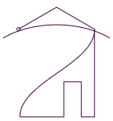

# Immutability

All the classes and most interfaces in TPVector are
[immutable](https://en.wikipedia.org/wiki/Immutable_object). This approach gives
a lot of comfort and safety. Consider the following piece of code:

<!-- deno-fmt-ignore -->
```ts
const myObject: Piece = createObject();
const myArrangedObjects = layout.row(
  makeSmaller(myObject),
  myObject,
  makeSmaller(myObject),
);
```

Without immutability, it is not certain whether `makeSmaller` modifies its
argument and then returns it, or if it returns a smaller copy of the argument.
With the immutability approach, you can be sure it's the latter, because it is
not possible to modify an object. So the code above returns three copies of the
original object, looking somewhat like this: `oOo`.

Throughout the TPVector library, whenever a method (or a function) the doc says:

<!-- deno-fmt-ignore -->
```ts
/** Does _something_ to `this`. */
someMethod(...) {
```

it really means:

<!-- deno-fmt-ignore -->
```ts
/** Returns a copy of `this`, with _something_ done to it. */
someMethod(...) {
```

## Turtle

This applies also to the [Turtle](../src/turtle.ts) class. All the drawing
methods like `forward` return a new object - a copy of the original Turtle, with
its position and drawn path updated. The original turtle is never affected.

In consequence, to call drawing operations in a loop, you need to store the new
Turtle every time, like this:

<!-- deno-fmt-ignore -->
```ts
let t = Turtle.create().right(18);
for (let i = 0; i < 5; i++)
  t = t.forward(10).right(144);
```

Alternative implementation:

<!-- deno-fmt-ignore -->
```ts
const starSide: TurtleFunc = t => t.forward(10).right(144);
let t = Turtle.create().right(18)
  .andThen(starSide).andThen(starSide).andThen(starSide)
  .andThen(starSide).andThen(starSide);
```

Result:<br> 

This takes some getting used to, but pays off greatly when the code gets more
complicated. A more complex example, making heavy use of immutability, with
explanation inline:

<!-- deno-fmt-ignore -->
```ts
/**
 * A TurtleFunc that executes the `func` and then draws a curve
 * along the same path, with an optional overshoot.
 */
function drawWithCurve(t: Turtle, func: TurtleFunc, overshoot = 0) {
  // This represents a turtle that has executed `func` and stands
  // where it finished.
  const tEnd = t.andThen(func);
  // First, execute `func`, just like `tEnd`.
  return tEnd
    // The `t` is still the original, unmodified Turtle. Jump to its
    // position and angle.
    .copy(t)
    // Move back a little, to the start point of the curve.
    .penUp().back(overshoot).penDown()
    // Draw the curve. Specify the end position in terms of `tEnd` -
    // just go a little forward from it.
    // Note that there's no need to call `.penUp()` because `curveTo`
    // takes only position and angle from the target, and ignores
    // any path that might be associated with it.
    .curveTo(tEnd.forward(overshoot), {speed: 0.8})
    // Restore the `tEnd` position. This is equivalent to
    // `.penUp().back(overshoot).penDown()`.
    .copy(tEnd);
  // This is just one of the ways to implement this function.
  // Another option would be to use the stack (`push` and `pop`
  // methods).
}

let t = Turtle.create()
  // Mark the start with a small circle.
  .circle(0.04)
  .right(60)
  // Draw the roof, with a curve.
  .andThen(
    drawWithCurve,
    t => t.forward(1).right(60).forward(1),
    0.4
  )
  .lookDown()
  // Draw some more lines, with a curve, no overshoot.
  .andThen(
    drawWithCurve,
    t => t
      // The wall.
      .forward(2)
      // The floor and the door. (This time draw without rotating.)
      .strafeRight(0.3).back(0.8).strafeRight(0.4).forward(0.8).strafeRight(1),
  );
```

Result:<br> 

## Performance considerations

Every time a [Turtle](../src/turtle.ts) (or any other [Piece](../src/pieces.ts))
is moved, rotated, transformed, or modified in any other way, a new object is
created. The object is usually small, as internally it references large parts of
the original object it is created from, but still this can affect performance
slightly because there is more work for the garbage collector.

This possible slight slowdown is acceptable in case of software like TPVector,
which is always operated by a human. , so tiny delays are not that significant,
and the final effect (in the form of the generated SVG) is not affected by the
performance at all.
