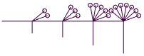

# Turtle tutorial

[Turtle](../src/turtle.ts) is one of the most powerful tools in TPVector. It
implements [turtle graphics](https://en.wikipedia.org/wiki/Turtle_graphics),
where you can draw by issuing commands like `forward`, `right`, `curve`, and
more. The ability to create complex shapes consisting of lines is highly
compatible with the cutting capabilities of a laser cutter.

This tutorial explains the most important features of Turtle, from the simple
figures, to the more complex control structures.

## Immutability

Just like all the classes in TPVector, Turtle is immutable. To make sure you are
familiar with the concept, and the consequences, see the
[Immutability](immutability.md) document for more information, and in particular
the [Turtle section](immutability.md#turtle).

## Representation in SVG

A single Turtle corresponds to a single
[`<path>`](https://developer.mozilla.org/en-US/docs/Web/SVG/Tutorial/Paths)
element in the SVG. The path is suitable for use in a cut run, but it is also
possible to give it attributes
([fill](https://developer.mozilla.org/en-US/docs/Web/SVG/Attribute/fill#path),
[stroke-width](https://developer.mozilla.org/en-US/docs/Web/SVG/Attribute/stroke-width)
or any other attribute supported by `<path>`), and place it in a print run. See
[Layers and runs](layers_and_runs.md) for more information.

## Coordinates

A Turtle is by default created at the origin (point `[0, 0]`), but different
coordinates can be specified. The Turtle is initially pointing upwards, in the
direction of the negative Y half-axis, which corresponds to the angle of 0.
Rotation clockwise (right) increases the angle.

## Commands

### Pen

The Turtle can have its pen _down_, meaning it is on, or _up_, meaning it is off
and does not draw. The draw commands only produce output with the pen down - if
it is up, they only update the position and angle of the Turtle, but don't
create any lines.

Methods:

- `penDown` and `penUp` - set the pen to the desired state; can also take a
  boolean argument to set the state based on a condition.
- `withPenDown` and `withPenUp` - execute the provided function
  ([TurtleFunc](#turtlefunc)) with pen up or down, as specified, and then
  restore the previous pen state; can also take a boolean argument to set the
  state based on a condition.

Note that the pen does not have color. The attributes like color or opacity can
be changed using `setAttributes` (inherited from Piece), but the color itself
does not make much sense for a laser anyway.

### Lines and turns

The most basic methods of Turtle are:

- `forward` and `back` - move the Turtle forward or back, drawing a line if the
  pen is down, or just updating the position if the pen is up.
- `right` and `left` - rotate the Turtle in place by the specified angle (in
  degrees), by default 90°.
- `turnBack` - rotate by 180°.
- `strafeRight` and `strafeLeft` - move the Turtle sideways, without changing
  its orientation.

Example:<br> 

<details><summary>Code</summary>

<!-- deno-fmt-ignore -->
```ts
Turtle.create()
  .left().forward(3)
  .right().forward(1).strafeRight(1).forward(0.5).strafeLeft(1).forward(0.5)
  .right().forward(3)
  .penUp().forward(0.3).left(155).back(0.2).penDown()
  .forward(3.4).left(85).forward(1.5)
```

</details>

### Absolute position and angle

- `goTo` - move to the given absolute coordinates (draw a line if the pen is
  down)
- `jumpTo` - jump to the given absolute coordinates (never draw a line)
- `setAngle` - sets the absolute direction of the Turtle (see
  [Coordinates](#coordinates))
- `lookUp`, `lookDown`, `lookRight`, `lookLeft` - set the absolute angle so that
  the Turtle faces the given direction
- `lookAt` - set the direction towards the specified absolute coordinates

Example:<br> 

<details><summary>Code</summary>

<!-- deno-fmt-ignore -->
```ts
Turtle.create([-1, 0])
  .repeat(18, t => t
    .arcRight(20, 1)
    .branch(t => t
      .lookAt([1.5, 0.5])
      .forward(0.5)
      .lookUp()
      .forward(0.1)
    )
  )
```

</details>

### Circle and ellipse arcs

There is a large selection of method for drawing circle and ellipse arcs:

- `arcRight` and `arcLeft` - draw a circle arc, over the specified angle and
  radius
- `roundCornerRight` and `roundCornerLeft` - draw a rounded 90° corner, with the
  specified radii
- `halfEllipseRight` and `halfEllipseLeft` - draw half of an ellipse, with the
  specified radii
- `circle` and `ellipse` - draw a circle or an ellipse centered at the current
  position.

Example:<br> 

<details><summary>Code</summary>

<!-- deno-fmt-ignore -->
```ts
Turtle.create()
  .circle(0.2)
  .arcRight(45, 1).forward(Math.sqrt(2)).arcRight(45, 1)
  .forward(1).ellipse(0.5, 1).forward(1)
  .roundCornerRight(3, 1)
  .forward(1)
  .halfEllipseRight(1, 7)
```

</details>

### Bézier curves

Turtle can draw the quadratic and cubic
[Bézier curves](https://developer.mozilla.org/en-US/docs/Web/SVG/Tutorial/Paths#b%C3%A9zier_curves)
supported by the SVG `<path>` element.

The most elementary function for drawing a Bézier curve is `curveTo`. The start
of the curve is defined by `this` Turtle, the target is passed as an argument,
and the curve control points are found by executing `forward` command on the
start Turtle, and `back` command on the target Turtle, with certain parameter
values (possibly negative). With these assumptions, the following curves can be
drawn:

- Quadratic curve (the default): As it has only one control point, so it must
  lie on the intersection of the lines defined by the start and the target
  Turtles, and is found automatically.
- Cubic curve: The two control points are defined by `startSpeed` and
  `targetSpeed`, namely the control points are `this.forward(startSpeed).pos`
  and `target.back(targetSpeed).pos`. Any of the speeds can be specified as
  `"auto"` (the default), which means that the intersection point will be used,
  just like for quadratic curve. Note however, that `{speed: "auto"}` (or
  equivalent `{}`) is still different from a quadratic cube, because it still
  uses two control points.

_Note:_ The default is a quadratic curve, which might give unexpected results
when the start and target Turtles are parallel or almost parallel, when the
intersection point is far away from them. In that case, just specify
`{speed: 1}` and tweak until the result is as needed.

Other methods for drawing Bézier curves:

- `curve` - often the most comfortable method to use, accepts a
  [function](#turtlefunc) and draws a curve from the current position to the
  result of the function, discarding any path the function might have drawn
- `smoothRight` and `smoothLeft` - draw a (quadratic by default) curve from the
  current position to another point on the edge of an imagined circle the Turtle
  lies on, pointing to its centre.
- `curveFromPop` and `curveFromPeek` - execute `pop` or `peek` and draw a curve
  from that point to the current position.

Example:<br> 

(The imagined circles for `smoothRight` and `smoothLeft` methods are also
drawn.)

<details><summary>Code</summary>

<!-- deno-fmt-ignore -->
```ts
// Starting on the left side.
Turtle.create()
  .curve(t => t.forward(1).right(80).forward(0.5))
  // Store this point.
  .push()
  .curve(t => t.lookRight().forward(4).strafeLeft(1), {speed: 2})
  .curve(t => t.right(5).forward(4).strafeRight(1), {speed: 2})
  // Draw an additional curve from the stored point.
  .curveFromPop({speed: 3})
  .curve(t => t.forward(3).right(120).forward(2))
  // Illustrate the imagined circle on which
  // the start and end of a smooth turn lies.
  .branch(t => t.left().arcRight(360, 1)).smoothRight(55, 1)
  .forward(7)
  .branch(t => t.left().arcRight(360, 1)).smoothRight(80, 1)
  // Go back to start.
  .curveTo(Turtle.create(), {speed: 1})
```

</details>

### Stack(s)

The Turtle has a
[stack](https://en.wikipedia.org/wiki/Stack_(abstract_data_type)), or, more
precisely, a collection of named stacks, where it can save its position, angle
and/or pen state.

Each of the stack-related functions can accept the stack key - a string or a
number identifying a stack. Stacks don't need to be declared beforehand, just
push to a stack with any key. Without the stack key, the methods operate on the
default stack.

- `push*` - push the current state, or the specified subset thereof, to the
  specified stack.
- `pop` - remove the state from the specified stack, and apply it to the Turtle.
  If this modifies the position, a line is never drawn, regardless of the pen
  state. If a partial state was pushed, only that part of the state is applied.
- `peek` - apply the state from the stack just like `pop`, but don't remove it
  from the stack.

Stacks often come in handy, but sometimes it's easier to use one of the other
mechanisms, like branches, or storing a Turtle in a variable (some examples in
the [Immutability](immutability.md) document).

### Branches and repeats

- `repeat` - execute the given [function](#turtlefunc) multiple times, passing
  the result of each call to the next call
- `branch` - execute the given function, keep whatever lines it generated, and
  finally restore the original state of the Turtle
- `branches` - execute the given function multiple times in a branch (the state
  of the Turtle is reset after each call)

Example:<br> 

<details><summary>Code</summary>

<!-- deno-fmt-ignore -->
```ts
Turtle.create().right()
  .repeat(5, (t, i) => t
    .forward(1)
    .branch(t => t.right().forward((i + 1) * 0.2))
    .branches(5, (t, j) => t.left((j + 1) * 20).forward(0.8))
  )

```

</details>

### Other

- `closePath` - close the path (see the `Z` command in
  [Path](https://developer.mozilla.org/en-US/docs/Web/SVG/Tutorial/Paths)); note
  that the result is no longer a Turtle, but rather a [Path](../src/path.ts)
  (which is another subclass of Piece)
- `dropPath` - forget the path drawn by this Turtle, and only retain its state
  and stacks; this is useful in some advanced scenarios
- `copy*` - copy the state, or the specified subset thereof, from another
  Turtle; this is useful in some advanced scenarios

## TurtleFunc

TurtleFunc is a function that takes a Turtle (and optionally some more
parameters) and returns a Turtle. A TurtleFunc can be considered a building
block, encoding a reusable part of Turtle's path. For example, the `wave`
function represents a wavy line going forward by ` unit:

<!-- deno-fmt-ignore -->
```ts
const wave: TurtleFunc = t => t
  .curveTo(t.forward(0.5).left(70), {speed: 0.3})
  .curveTo(t.forward(1), {speed: 0.3});
```

Or equivalent:

<!-- deno-fmt-ignore -->
```ts
function wave(t: Turtle) {
  return t
    .curveTo(t.forward(0.5).left(70), {speed: 0.3})
    .curveTo(t.forward(1), {speed: 0.3});
}
```

The function can be used (and reused) for example like this:

<!-- deno-fmt-ignore -->
```ts
Turtle.create().right().andThen(wave).forward(0.5).andThen(wave)
```

Result:<br> 

<details><summary>A parametrised version of the function</summary>

Let's make the size of the wave a parameter:

<!-- deno-fmt-ignore -->
```ts
const wave: TurtleFunc<[number?]> = (t, len = 1) => t
  .curveTo(t.forward(len / 2).left(70), {speed: 0.3 * len})
  .curveTo(t.forward(len), {speed: 0.3 * len});
```

Or equivalent:

<!-- deno-fmt-ignore -->
```ts
function wave(t: Turtle, len = 1) {
  return t
    .curveTo(t.forward(len / 2).left(70), {speed: 0.3 * len})
    .curveTo(t.forward(len), {speed: 0.3 * len});
}
```

Now let's use the function:

<!-- deno-fmt-ignore -->
```ts
Turtle.create().right().andThen(wave).andThen(wave, 2).andThen(wave)
```

Result:<br> 

Of course the speed could be made into a separate parameter, with `0.3 * len` as
the default, to create even more interesting results.

</details>

Another use, a pentagon with wavy sides:

<!-- deno-fmt-ignore -->
```ts
Turtle.create().right(18).repeat(5, t => t.andThen(wave).right(144))
```

Result:<br> 

A TurtleFunc can be passed to some of Turtle's methods, like `branch`, `repeat`,
`withPenDown` or `curve`.

## Turtle as a Piece

Turtle extends the [Piece](../src/pieces.ts) class, which means that all the
methods like `transform`, `setLayer`, `setAttributes` etc. are available on it,
however note that they must be called last, after all the drawing calls, because
the result is no longer a Turtle, but rather only a Piece.

A single Turtle can also be used multiple times, e.g. in different scales, with
different attributes, and on different layers, because it is immutable. See the
[Immutability](immutability.md) document for more information.
